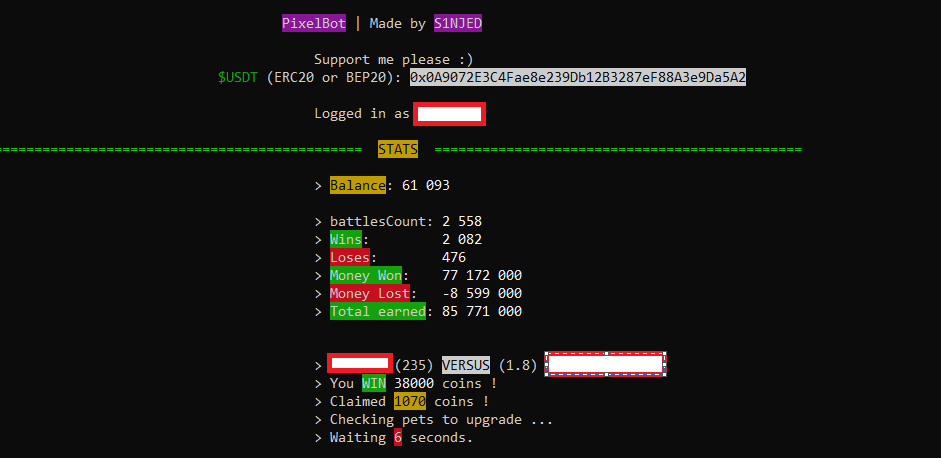
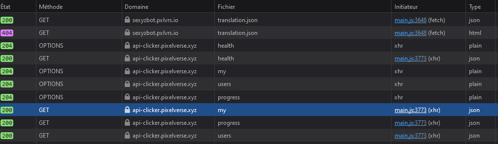
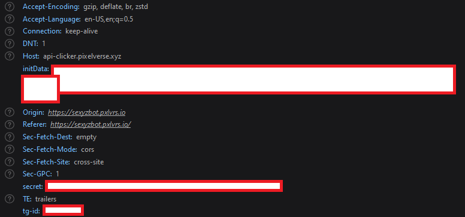
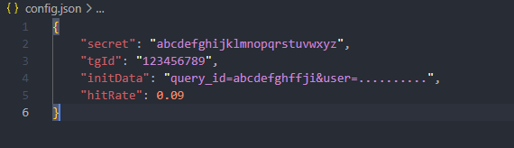

# PixelTap Bot by S1NJED

⚠️ Pixelverse don't work on PC anymore **BUT** you can still retrieve the needed credentials in the Network tab and the bot still work (22/06/24)

✅ Auto claim rewards 
✅ Auto fight 
✅ Auto upgrade pets 

TODO:

❌ Auto Claim Daily 
❌ Auto buy pets 

## Installation

NOTE: for some people `pip` don't work, use `pip3` instead

You will need `python` (__[Download here](https://www.python.org/downloads/)__)

- Download the code and open a terminal in the good directory
- Or `clone` the repo
    > `git clone https://github.com/S1NJED/PixelTapBot.git`
- Change the directory
    > `cd PixelTapBot`
- Install the dependencies
    > `pip install -r requirements.txt`

## Setup

NOTE: for some people `python` does not work, use `python3` instead.

In order to make the bot work you will need to retrieve some tokens.

- Open telegram web and open the `Network` panel by pressing `F12`.
- Open the PixelTap telegram bot
- Find the request '`my`' and click on it:

- Then click on the `Headers` part and scroll down until you are in the `Request headers` part.
- In this section you will need to retrieve the value of `initData`, `secret`, `tg-id`:

- Add them in the `config.json` file so it look like this and save the file:

## Start

Great, now your bot is ready to fight !

To start the bot simply use this command:

> `python main.py`

And voila, your bot will run 24/7 unless their servers are broken, which you will need to restart manually the bot (I suppose)

## My advice

- You can change the `hitRate` but you can decrease it until 0.08, if you go further, the bot will not work anymore because you will make too many requests too fast. And do not need to restart the bot if you make changes in the `config.json` file.
- You can run more than 1 instances **BUT** i do not recomend it, but you can still do it.

## Educational Purposes

This project is designed and intended for educational purposes only.

## License

Distributed under the MIT License. See `LICENSE.txt` for more information.

## Support me

If you want to support me:

**`$USDT`** (ERC20 or BEP20) `0x0A9072E3C4Fae8e239Db12B3287eF88A3e9Da5A2`
